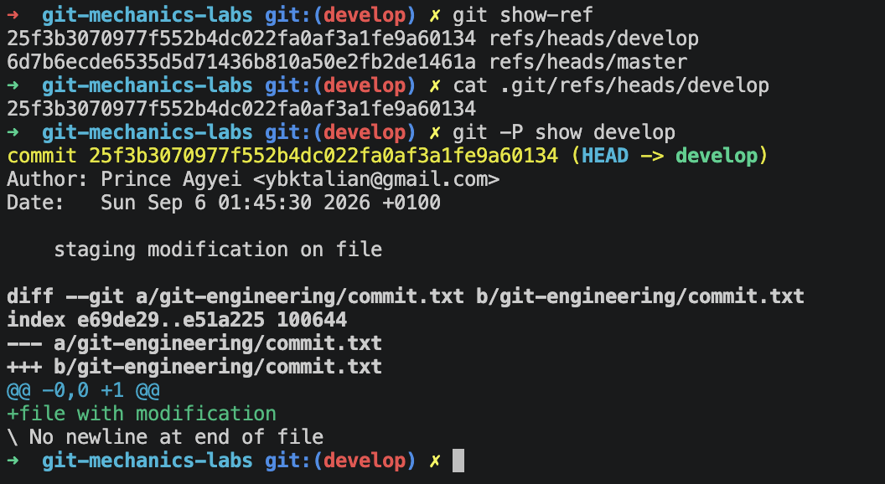
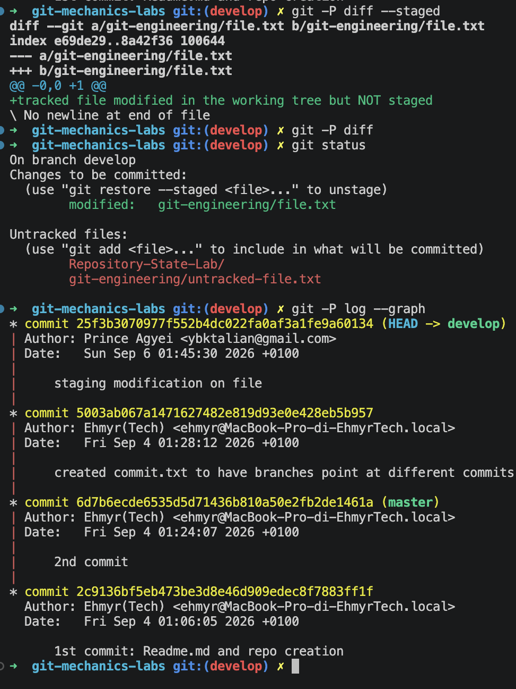

## Inspecting git state

`HEAD` currenlty pointing to `develop`
`cat .git/HEAD`
`git -P show HEAD`

`develop` is pointing to the last commit ending in `e9a60134` 
`git show-ref`
`cat .git/refs/heads/develop`
`git -P show develop `

`master` is pointing to the last commit ending in `2de1461a`

`cat .git/refs/heads/master`
`git -P show master`

HEAD vs index

shows staged changes, what will be in the next commit. Eseentially the diffrences between the current commit and the next commit

`git -P diff --staged`

index vs working tree 

`git -P diff` changes made to the code but not staged(`git add`) yet.

untracked

`git status` shows: changes to be committed, changes not staged for commit and untracked files, it is a state-compariso summary.

commit graph 

`git -P log --graph` shows a graphical commit history 

